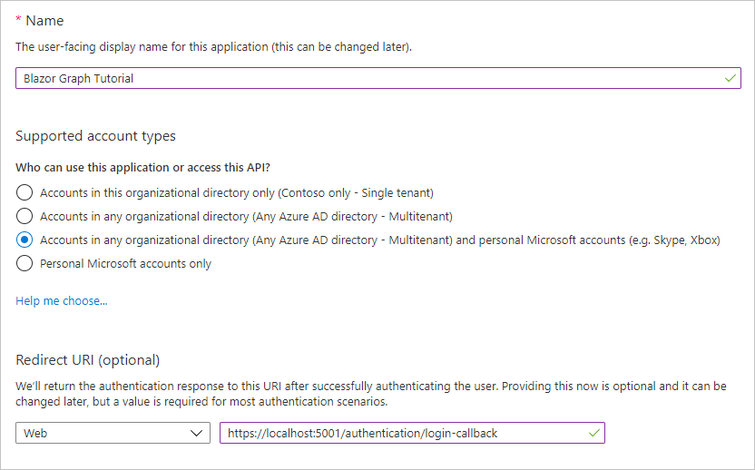

# <a name="how-to-run-the-completed-project"></a><span data-ttu-id="a4be4-101">如何运行已完成的项目</span><span class="sxs-lookup"><span data-stu-id="a4be4-101">How to run the completed project</span></span>

## <a name="prerequisites"></a><span data-ttu-id="a4be4-102">先决条件</span><span class="sxs-lookup"><span data-stu-id="a4be4-102">Prerequisites</span></span>

<span data-ttu-id="a4be4-103">若要在此文件夹中运行已完成的项目，您需要以下各项：</span><span class="sxs-lookup"><span data-stu-id="a4be4-103">To run the completed project in this folder, you need the following:</span></span>

- <span data-ttu-id="a4be4-104">在开发计算机上安装的 [.Net CORE SDK](https://dotnet.microsoft.com/download) 。</span><span class="sxs-lookup"><span data-stu-id="a4be4-104">The [.NET Core SDK](https://dotnet.microsoft.com/download) installed on your development machine.</span></span> <span data-ttu-id="a4be4-105"> (**注意：** 本教程是使用 .NET Core SDK 版本3.1.402 编写的。</span><span class="sxs-lookup"><span data-stu-id="a4be4-105">(**Note:** This tutorial was written with .NET Core SDK version 3.1.402.</span></span> <span data-ttu-id="a4be4-106">本指南中的步骤可能适用于其他版本，但尚未经过测试。 ) </span><span class="sxs-lookup"><span data-stu-id="a4be4-106">The steps in this guide may work with other versions, but that has not been tested.)</span></span>
- <span data-ttu-id="a4be4-107">使用 Outlook.com 上的邮箱的个人 Microsoft 帐户，或者是 Microsoft 工作或学校帐户。</span><span class="sxs-lookup"><span data-stu-id="a4be4-107">Either a personal Microsoft account with a mailbox on Outlook.com, or a Microsoft work or school account.</span></span>

<span data-ttu-id="a4be4-108">如果你没有 Microsoft 帐户，可以使用以下几种方法获取免费帐户：</span><span class="sxs-lookup"><span data-stu-id="a4be4-108">If you don't have a Microsoft account, there are a couple of options to get a free account:</span></span>

- <span data-ttu-id="a4be4-109">你可以 [注册新的个人 Microsoft 帐户](https://signup.live.com/signup?wa=wsignin1.0&rpsnv=12&ct=1454618383&rver=6.4.6456.0&wp=MBI_SSL_SHARED&wreply=https://mail.live.com/default.aspx&id=64855&cbcxt=mai&bk=1454618383&uiflavor=web&uaid=b213a65b4fdc484382b6622b3ecaa547&mkt=E-US&lc=1033&lic=1)。</span><span class="sxs-lookup"><span data-stu-id="a4be4-109">You can [sign up for a new personal Microsoft account](https://signup.live.com/signup?wa=wsignin1.0&rpsnv=12&ct=1454618383&rver=6.4.6456.0&wp=MBI_SSL_SHARED&wreply=https://mail.live.com/default.aspx&id=64855&cbcxt=mai&bk=1454618383&uiflavor=web&uaid=b213a65b4fdc484382b6622b3ecaa547&mkt=E-US&lc=1033&lic=1).</span></span>
- <span data-ttu-id="a4be4-110">你可以 [注册 office 365 开发人员计划](https://developer.microsoft.com/office/dev-program) 以获取免费的 office 365 订阅。</span><span class="sxs-lookup"><span data-stu-id="a4be4-110">You can [sign up for the Office 365 Developer Program](https://developer.microsoft.com/office/dev-program) to get a free Office 365 subscription.</span></span>

## <a name="register-a-web-application-with-the-azure-active-directory-admin-center"></a><span data-ttu-id="a4be4-111">向 Azure Active Directory 管理中心注册 web 应用程序</span><span class="sxs-lookup"><span data-stu-id="a4be4-111">Register a web application with the Azure Active Directory admin center</span></span>

1. <span data-ttu-id="a4be4-112">打开浏览器，并转到 [Azure Active Directory 管理中心](https://aad.portal.azure.com)。</span><span class="sxs-lookup"><span data-stu-id="a4be4-112">Open a browser and navigate to the [Azure Active Directory admin center](https://aad.portal.azure.com).</span></span> <span data-ttu-id="a4be4-113">使用 **个人帐户**（亦称为“Microsoft 帐户”）或 **工作或学校帐户** 登录。</span><span class="sxs-lookup"><span data-stu-id="a4be4-113">Login using a **personal account** (aka: Microsoft Account) or **Work or School Account**.</span></span>

1. <span data-ttu-id="a4be4-114">选择左侧导航栏中的“**Azure Active Directory**”，再选择“**管理**”下的“**应用注册**”。</span><span class="sxs-lookup"><span data-stu-id="a4be4-114">Select **Azure Active Directory** in the left-hand navigation, then select **App registrations** under **Manage**.</span></span>

    

1. <span data-ttu-id="a4be4-116">选择“新注册”。</span><span class="sxs-lookup"><span data-stu-id="a4be4-116">Select **New registration**.</span></span> <span data-ttu-id="a4be4-117">在“注册应用”页上，按如下方式设置值。</span><span class="sxs-lookup"><span data-stu-id="a4be4-117">On the **Register an application** page, set the values as follows.</span></span>

    - <span data-ttu-id="a4be4-118">将“名称”设置为“`Blazor Graph Tutorial`”。</span><span class="sxs-lookup"><span data-stu-id="a4be4-118">Set **Name** to `Blazor Graph Tutorial`.</span></span>
    - <span data-ttu-id="a4be4-119">将“受支持的帐户类型”设置为“任何组织目录中的帐户和个人 Microsoft 帐户”。</span><span class="sxs-lookup"><span data-stu-id="a4be4-119">Set **Supported account types** to **Accounts in any organizational directory and personal Microsoft accounts**.</span></span>
    - <span data-ttu-id="a4be4-120">在“重定向 URI”下，将第一个下拉列表设置为“`Web`”，并将值设置为“`https://localhost:5001/authentication/login-callback`”。</span><span class="sxs-lookup"><span data-stu-id="a4be4-120">Under **Redirect URI**, set the first drop-down to `Web` and set the value to `https://localhost:5001/authentication/login-callback`.</span></span>

    

1. <span data-ttu-id="a4be4-122">选择“**注册**”。</span><span class="sxs-lookup"><span data-stu-id="a4be4-122">Select **Register**.</span></span> <span data-ttu-id="a4be4-123">在 **Blazor Graph 教程** 页面上，将应用程序的值复制 **(客户端) ID** 并保存它，在下一步中将需要它。</span><span class="sxs-lookup"><span data-stu-id="a4be4-123">On the **Blazor Graph Tutorial** page, copy the value of the **Application (client) ID** and save it, you will need it in the next step.</span></span>

    

1. <span data-ttu-id="a4be4-125">选择“管理”下的“身份验证”。</span><span class="sxs-lookup"><span data-stu-id="a4be4-125">Select **Authentication** under **Manage**.</span></span> <span data-ttu-id="a4be4-126">找到 " **隐式授予** " 部分并启用 **访问令牌** 和 **ID 令牌**。</span><span class="sxs-lookup"><span data-stu-id="a4be4-126">Locate the **Implicit grant** section and enable **Access tokens** and **ID tokens**.</span></span> <span data-ttu-id="a4be4-127">选择“**保存**”。</span><span class="sxs-lookup"><span data-stu-id="a4be4-127">Select **Save**.</span></span>

## <a name="configure-the-sample"></a><span data-ttu-id="a4be4-128">配置示例</span><span class="sxs-lookup"><span data-stu-id="a4be4-128">Configure the sample</span></span>

1. <span data-ttu-id="a4be4-129">将文件 **上的/GraphTutorial/wwwroot/appsettings.example.js** 重命名为 **appsettings.json**。</span><span class="sxs-lookup"><span data-stu-id="a4be4-129">Rename the **/GraphTutorial/wwwroot/appsettings.example.json** file to **appsettings.json**.</span></span>

1. <span data-ttu-id="a4be4-130">编辑 **appsettings.js** 并替换 `YOUR_APP_ID_HERE` 为您的应用程序 ID。</span><span class="sxs-lookup"><span data-stu-id="a4be4-130">Edit **appsettings.json** and replace `YOUR_APP_ID_HERE` with your application ID.</span></span>

## <a name="run-the-sample"></a><span data-ttu-id="a4be4-131">运行示例</span><span class="sxs-lookup"><span data-stu-id="a4be4-131">Run the sample</span></span>

<span data-ttu-id="a4be4-132">在 CLI 中，运行以下命令以启动应用程序。</span><span class="sxs-lookup"><span data-stu-id="a4be4-132">In your CLI, run the following command to start the application.</span></span>

```Shell
dotnet run
```
