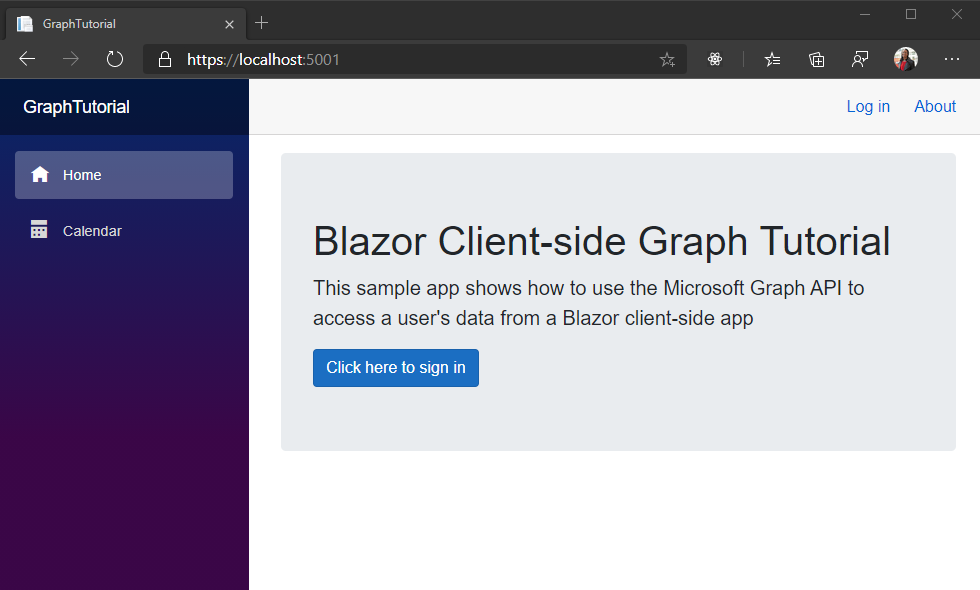

<!-- markdownlint-disable MD002 MD041 -->

首先创建 Blazor WebAssembly 应用程序。

1. 在要创建项目的目录中打开命令行界面 (CLI) 。 运行以下命令。

    ```Shell
    dotnet new blazorwasm --auth SingleOrg -o GraphTutorial
    ```

    该 `--auth SingleOrg` 参数将导致生成的项目包含用于 Microsoft identity platform 的身份验证的配置。

1. 创建项目后，通过将当前目录更改为 **GraphTutorial** 目录并在 CLI 中运行以下命令来验证它是否正常工作。

    ```Shell
    dotnet watch run
    ```

1. 打开浏览器并浏览到 `https://localhost:5001` 。 如果一切正常，您应该会看到 "Hello，world！" 消息。

> [!IMPORTANT]
> 如果您收到一条警告，指出 **localhost** 的证书不受信任，可以使用 .NET Core CLI 安装和信任开发证书。 有关特定操作系统的说明，请参阅 [在 ASP.NET Core 中强制 HTTPS](/aspnet/core/security/enforcing-ssl?view=aspnetcore-3.1) 。

## <a name="add-nuget-packages"></a>添加 NuGet 包

在继续之前，请安装稍后将使用的一些其他 NuGet 包。

- 用于调用 Microsoft Graph 的[microsoft](https://www.nuget.org/packages/Microsoft.Graph/) graph。
- 用于将 Windows 时区标识符转换为 IANA 标识符的[TimeZoneConverter](https://github.com/mj1856/TimeZoneConverter) 。

1. 在 CLI 中运行以下命令来安装依赖项。

    ```Shell
    dotnet add package Microsoft.Graph --version 3.18.0
    dotnet add package TimeZoneConverter
    ```

## <a name="design-the-app"></a>设计应用程序

在本节中，您将创建应用程序的基本 UI 结构。

1. 删除模板生成的示例页面。 删除以下文件。

    - **./Pages/Counter.razor**
    - **./Pages/FetchData.razor**
    - **./Shared/SurveyPrompt.razor**
    - **./wwwroot/sample-data/weather.js**

1. 打开 **/wwwroot/index.html** ，并将以下代码添加到结束标记的 **前面** `</body>` 。

    :::code language="html" source="../demo/GraphTutorial/wwwroot/index.html" id="BootStrapJSSnippet":::

    这将添加 [引导数据库](https://getbootstrap.com/docs/4.5/getting-started/introduction/) javascript 文件。

1. 打开 **/wwwroot/css/app.css** ，并添加以下代码。

    :::code language="css" source="../demo/GraphTutorial/wwwroot/css/app.css" id="CssSnippet":::

1. 打开 **/Shared/NavMenu.razor** ，并将其内容替换为以下内容。

    :::code language="razor" source="../demo/GraphTutorial/Shared/NavMenu.razor" id="NavMenuSnippet":::

1. 打开 **/Pages/Index.razor** ，并将其内容替换为以下内容。

    :::code language="razor" source="../demo/GraphTutorial/Pages/Index.razor" id="IndexSnippet":::

1. 打开 **/Shared/LoginDisplay.razor** ，并将其内容替换为以下内容。

    ```razor
    @using Microsoft.AspNetCore.Components.Authorization
    @using Microsoft.AspNetCore.Components.WebAssembly.Authentication

    @inject NavigationManager Navigation
    @inject SignOutSessionStateManager SignOutManager

    <AuthorizeView>
        <Authorized>
            <a class="text-decoration-none" data-toggle="dropdown" href="#" role="button">
                
            </a>
            <div class="dropdown-menu dropdown-menu-right">
                <h5 class="dropdown-item-text mb-0">@context.User.Identity.Name</h5>
                <p class="dropdown-item-text text-muted mb-0">placeholder@contoso.com</p>
                <div class="dropdown-divider"></div>
                <button class="dropdown-item" @onclick="BeginLogout">Log out</button>
            </div>
        </Authorized>
        <NotAuthorized>
            <a href="authentication/login">Log in</a>
        </NotAuthorized>
    </AuthorizeView>

    @code{
        private async Task BeginLogout(MouseEventArgs args)
        {
            await SignOutManager.SetSignOutState();
            Navigation.NavigateTo("authentication/logout");
        }
    }
    ```

1. 在 **/wwwroot** 目录中创建一个名为 **img** 的新目录。 在此目录中添加你选择命名 **no-profile-photo.png** 的图像文件。 当用户在 Microsoft Graph 中没有照片时，此图像将用作用户的照片。

    > [!TIP]
    > 您可以从 [GitHub](https://github.com/microsoftgraph/msgraph-training-blazor-clientside/blob/master/demo/GraphTutorial/wwwroot/img/no-profile-photo.png)下载这些屏幕截图中使用的图像。

1. 保存所有更改并刷新页面。

    
