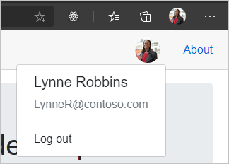

<!-- markdownlint-disable MD002 MD041 -->

在本练习中，你将扩展上一练习中的应用程序，以支持 Azure AD 的身份验证。 若要获取所需的 OAuth 访问令牌以调用 Microsoft Graph API，这是必需的。

1. 打开 **/wwwroot/appsettings.js**。 添加 `GraphScopes` 属性并更新 `Authority` 和 `ClientId` 值以匹配以下项。

    :::code language="json" source="../demo/GraphTutorial/wwwroot/appsettings.example.json" highlight="3-4,7":::

    `YOUR_APP_ID_HERE`将替换为应用注册中的应用程序 ID。

    > [!IMPORTANT]
    > 如果您使用的是源代码管理（如 git），现在可以从源代码管理中排除文件的 **appsettings.js** ，以避免无意中泄漏您的应用程序 ID。

    查看值中包含的作用域 `GraphScopes` 。

    - **用户。 Read** 允许应用程序获取用户的配置文件和照片。
    - **MailboxSettings** 允许应用程序获取邮箱设置，其中包括用户的首选时区。
    - **ReadWrite** 允许应用程序读取和写入用户日历。

## <a name="implement-sign-in"></a>实施登录

此时，.NET Core 项目模板添加了用于启用登录的代码。 但是，在本节中，您将添加其他代码，以通过将 Microsoft Graph 中的信息添加到用户的标识来改进体验。

1. 打开 **/Pages/Authentication.razor** ，并将其内容替换为以下内容。

    :::code language="razor" source="../demo/GraphTutorial/Pages/Authentication.razor" id="AuthenticationSnippet":::

    这将在登录失败时替换默认错误消息，以显示身份验证过程返回的任何错误消息。

1. 在名为 **Graph** 的项目的根目录中创建一个新目录。

1. 在名为 **GraphUserAccountFactory.cs** 的 **/Graph** 目录中创建一个新文件，并添加以下代码。

    ```csharp
    using System.Security.Claims;
    using System.Threading.Tasks;
    using Microsoft.AspNetCore.Components.WebAssembly.Authentication;
    using Microsoft.AspNetCore.Components.WebAssembly.Authentication.Internal;
    using Microsoft.Extensions.Logging;
    using Microsoft.Graph;

    namespace GraphTutorial.Graph
    {
        // Extends the AccountClaimsPrincipalFactory that builds
        // a user identity from the identity token.
        // This class adds additional claims to the user's ClaimPrincipal
        // that hold values from Microsoft Graph
        public class GraphUserAccountFactory
            : AccountClaimsPrincipalFactory<RemoteUserAccount>
        {
            private readonly IAccessTokenProviderAccessor accessor;
            private readonly ILogger<GraphUserAccountFactory> logger;

            public GraphUserAccountFactory(IAccessTokenProviderAccessor accessor,
                ILogger<GraphUserAccountFactory> logger)
            : base(accessor)
            {
                this.accessor = accessor;
                this.logger = logger;
            }

            public async override ValueTask<ClaimsPrincipal> CreateUserAsync(
                RemoteUserAccount account,
                RemoteAuthenticationUserOptions options)
            {
                // Create the base user
                var initialUser = await base.CreateUserAsync(account, options);

                // If authenticated, we can call Microsoft Graph
                if (initialUser.Identity.IsAuthenticated)
                {
                    try
                    {
                        // Add additional info from Graph to the identity
                        await AddGraphInfoToClaims(accessor, initialUser);
                    }
                    catch (AccessTokenNotAvailableException exception)
                    {
                        logger.LogError($"Graph API access token failure: {exception.Message}");
                    }
                    catch (ServiceException exception)
                    {
                        logger.LogError($"Graph API error: {exception.Message}");
                        logger.LogError($"Response body: {exception.RawResponseBody}");
                    }
                }

                return initialUser;
            }

            private async Task AddGraphInfoToClaims(
                IAccessTokenProviderAccessor accessor,
                ClaimsPrincipal claimsPrincipal)
            {
                // TEMPORARY: Get the token and log it
                var result = await accessor.TokenProvider.RequestAccessToken();

                if (result.TryGetToken(out var token))
                {
                    logger.LogInformation($"Access token: {token.Value}");
                }
            }
        }
    }
    ```

    此类扩展 **AccountClaimsPrincipalFactory** 类并重写该 `CreateUserAsync` 方法。 目前，此方法仅记录用于调试目的的访问令牌。 在本练习的稍后部分，您将实现 Microsoft Graph 调用。

1. 打开 **./Program.cs** 并 `using` 在文件顶部添加以下语句。

    ```csharp
    using Microsoft.AspNetCore.Components.WebAssembly.Authentication;
    using GraphTutorial.Graph;
    ```

1. 在中 `Main` ，将现有 `builder.Services.AddMsalAuthentication` 呼叫替换为以下项。

    :::code language="csharp" source="../demo/GraphTutorial/Program.cs" id="AddMsalAuthSnippet":::

    请考虑此代码执行的操作。

    - 它 `GraphScopes` 在中加载 **appsettings.js** 的值，并将每个作用域添加到 MSAL 提供程序使用的默认范围。
    - 它将现有帐户工厂替换为 **GraphUserAccountFactory** 类。

1. 保存更改并重新启动该应用。 使用 " **登录** " 链接登录。 查看并接受请求的权限。

1. 应用程序将使用欢迎消息进行刷新。 访问浏览器的开发人员工具，并查看 " **控制台** " 选项卡。应用程序会记录访问令牌。

    

## <a name="get-user-details"></a>获取用户详细信息

用户登录后，可以从 Microsoft Graph 获取其信息。 在本节中，你将使用 Microsoft Graph 中的信息将其他声明添加到用户的 **ClaimsPrincipal** 中。

1. 在名为 **GraphClaimsPrincipalExtensions.cs** 的 **/Graph** 目录中创建一个新文件，并添加以下代码。

    :::code language="csharp" source="../demo/GraphTutorial/Graph/GraphClaimsPrincipalExtensions.cs" id="GraphClaimsExtensionsSnippet":::

    此代码实现 **ClaimsPrincipal** 类的扩展方法，使您可以使用 Microsoft Graph 对象的值获取和设置声明。

1. 在名为 **BlazorAuthProvider.cs** 的 **/Graph** 目录中创建一个新文件，并添加以下代码。

    :::code language="csharp" source="../demo/GraphTutorial/Graph/BlazorAuthProvider.cs" id="BlazorAuthProviderSnippet":::

    此代码实现 Microsoft Graph SDK 的身份验证提供程序，该提供程序使用 AspNetCore 获取访问令牌的 **IAccessTokenProviderAccessor** 提供的 **WebAssembly。**

1. 在名为 **GraphClientFactory.cs** 的 **/Graph** 目录中创建一个新文件，并添加以下代码。

    :::code language="csharp" source="../demo/GraphTutorial/Graph/GraphClientFactory.cs" id="GraphClientFactorySnippet":::

    此类创建一个配置了 **BlazorAuthProvider** 的 **GraphServiceClient** 。

1. 打开 **./Program.cs** 并将新的 **HttpClient** 的 **BaseAddress** 更改为 `"https://graph.microsoft.com"` 。

    :::code language="csharp" source="../demo/GraphTutorial/Program.cs" id="HttpClientSnippet":::

1. 在行前面添加以下代码 `await builder.Build().RunAsync();` 。

    :::code language="csharp" source="../demo/GraphTutorial/Program.cs" id="AddGraphClientFactorySnippet":::

    这会将 **GraphClientFactory** 添加为一个范围内的服务，我们可以通过依赖关系注入进行使用。

1. 打开 **/Graph/GraphUserAccountFactory.cs** ，并将以下属性添加到类中。

    ```csharp
    private readonly GraphClientFactory clientFactory;
    ```

1. 更新构造函数以获取 **GraphClientFactory** 参数，并将其分配给 `clientFactory` 属性。

    :::code language="csharp" source="../demo/GraphTutorial/Graph/GraphUserAccountFactory.cs" id="ConstructorSnippet" highlight="2,7":::

1. 将现有的 `AddGraphInfoToClaims` 函数替换为以下内容。

    :::code language="csharp" source="../demo/GraphTutorial/Graph/GraphUserAccountFactory.cs" id="AddGraphInfoToClaimsSnippet":::

    请考虑此代码执行的操作。

    - 它 [获取用户的配置文件](https://docs.microsoft.com/graph/api/user-get)。
        - 它用 `Select` 来限制返回的属性。
    - 它将 [获取用户的照片](https://docs.microsoft.com/graph/api/profilephoto-get)。
        - 它会专门请求用户照片的48x48 像素版本。
    - 将信息添加到 **ClaimsPrincipal** 中。

1. 打开 **/Shared/LoginDisplay.razor** 并进行以下更改。

    - 替换 `/img/no-profile-photo.png` 为 `@(context.User.GetUserGraphPhoto() ?? "/img/no-profile-photo.png")` 。
    - 替换 `placeholder@contoso.com` 为 `@context.User.GetUserGraphEmail()` 。

    ```razor
    ...
    

    ...

    <p class="dropdown-item-text text-muted mb-0">@context.User.GetUserGraphEmail()</p>
    ...
    ```

1. 保存全部更改并重新启动该应用程序。 登录到应用程序。 应用程序将更新，以在顶部菜单中显示用户的照片。 选择用户的照片将打开一个下拉菜单，其中包含用户的姓名、电子邮件地址和 **"注销" 按钮。**

    

    
